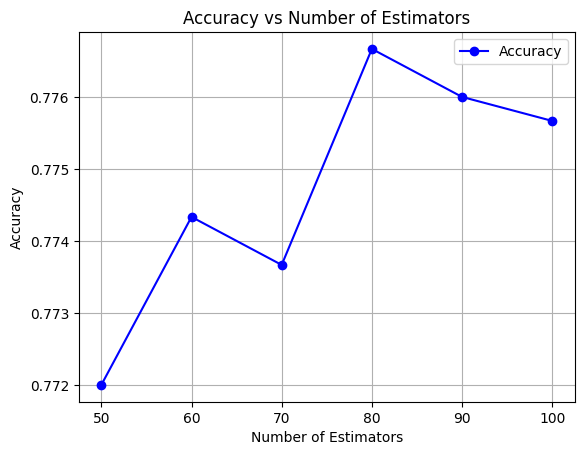

# cse151a-trash
## Milestone 2 Preprocessing Data

Our main goal is to classify waste items into three general categories: 
* **Landfill**: Items that are non-recyclable or non-compostable and should be disposed of in landfills. 
* **Recyclable**: Items that can be recycled, such as plastics, metals, glass, and paper products.
* **Compost**: Items that can decompose and be used as compost.

As a preprocessing step, we plan on combining the existing 30 waste categories into these broader categories. Additionally, we plan to create a train-test split using both the default and real images, with an 80/20 split. We will also apply min-max normalization to keep our image pixel data on a scale between 0 and 1. After normalization, we will apply a filter to decrease noise in our images; while we haven't yet finalized our choice, we are considering either a Gaussian or median filter. Below is an example of how we may reclassify our data:

| label | category/class |
|:------|:---------------|
| `'aerosol_cans'` | if empty recyclable, otherwise landfill |
| `'aluminum_food_cans'` | recyclable |
| `'aluminum_soda_cans'` | recyclable |
| `'cardboard_boxes'` | recyclable |
| `'cardboard_packaging'` | recyclable |
| `'clothing'` | landfill |
| `'coffee_grounds'` | compost |
| `'disposable_plastic_cutlery'` | landfill |
| `'eggshells'` | compost |
| `'food_waste'` | compost |
| `'glass_beverage_bottles'` | recyclable |
| `'glass_cosmetic_containers'` | recyclable |
| `'glass_food_jars'` | recyclable |
| `'magazines'` | recyclable |
| `'newspaper'` | recyclable |
| `'office_paper'` | recyclable |
| `'paper_cups'` | recyclable as long as not wax coated |
| `'plastic_cup_lids'` | recyclable? |
| `'plastic_detergent_bottles'` | recyclable |
| `'plastic_food_containers'` | recyclable |
| `'plastic_shopping_bags'` | landfill |
| `'plastic_soda_bottles'` | recyclable |
| `'plastic_straws'` | recyclable |
| `'plastic_trash_bags'` | landfill |
| `'plastic_water_bottles'` | recyclable |
| `'shoes'` | landfill |
| `'steel_food_cans'` | recyclable |
| `'styrofoam_cups'` | landfill |
| `'styrofoam_food_containers'` | landfill |
| `'tea_bags'` | compost if plastic free |

## Milestone 3 
1. **Major Preprocessing**
   
   * For preprocessing, we categorized the trash data into ``recycling``, ``landfil``, and ``compost`` classes.
   * Split our dataset 60:20:20 for our training, validation, and test set.
   * Applied min-max normalization to the pixel data of the images, scaling each pixel value to be within the 0 to 1 range.

2. **Train your first model**
   
   We used a **Random Forest** classifier for our first model to classify trash images. Our dataset contains a class imbalance, with recycling being the dominant class, which could potentially affect model performance. Given that Random Forest is suited for handling large and imbalanced datasets, we chose it as our initial model. The model was trained with basic parameters.

3. Evaluate your model and compare training vs. test error
   
   Our model had an accuracy of 0.8316 on our test set, meaning it had an error of 0.1684.

5. Answer the questions: Where does your model fit in the fitting graph?
   
   
   
   Our final model falls on the right of the fitting graph (created using our validation set) with the hyperparameter of n_estimators tuned to 80. 

7. What are the next models you are thinking of and why?

   We are thinking of using a CNN next because of the following advantages:
   * Automatic Feature Learning: CNNs can learn to recognize patterns in images on their own, like edges, shapes, and textures.
   * Spatial Invariance: They can identify objects no matter where they are in the image.
   * Efficient Processing: CNNs can process large images quickly.
   * High Accuracy: They are very good at correctly classifying images.
   We are also thinking of applying a RandomizedSearchCV to optimize our initial model because it obtained reasonably high accuracy but was overfitted.

9. What is the conclusion of your 1st model? What can be done to possibly improve it?
   * Conclusion: The model achieved an accuracy of 84.27% on the test set, indicating that it performs reasonably well in classifying trash images into recyclable, compost, and landfill categories. However, the model also showed signs of overfitting, with a nearly perfect training accuracy of 99.95%. This suggests that while the model is effective, there can be improvements made.
   * Improvements:
        * Apply additional hyperparameter tuning using techniques like Randomized Search and regularization techniques to improve generalization to unseen data.
        * Extract additional meaningful features, such as texture or shape descriptors, to provide more meaningful inputs to the model.

