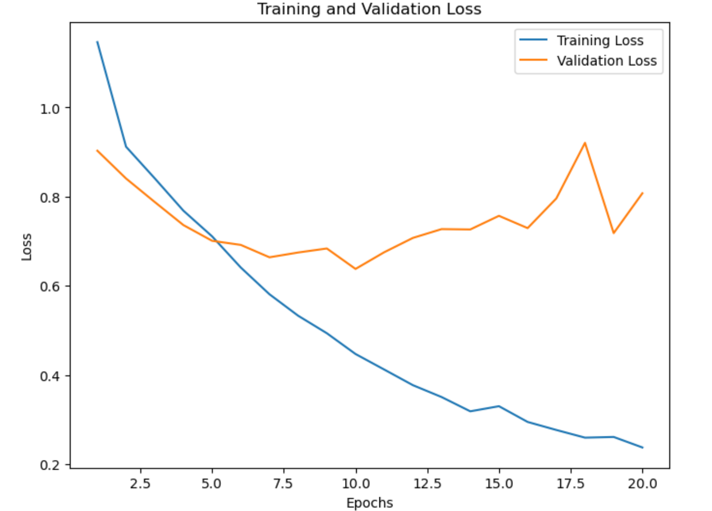

# CSE151A Project
## Introduction

Effective waste management is essential to environmental health. Improper waste management contributes to pollution, the spread of disease, contamination, ecosystem degradation, and worsened climate change. A key step in waste management starts by properly identifying waste as recyclable, landfill, or compost. However, due to the barrier of improper identification of waste items and non-immediate consequences, people often dispose of waste in the wrong containers. Our project applies machine learning-based image classification techniques to automate the identification and sorting of waste into landfill, recyclable, or compost categories. This will improve waste management by automating the sorting process, increasing accuracy, and preventing items like recyclables from being incorrectly sent to landfills. In the long-term, we hope that projects like ours enhance waste management systems, minimize environmental harm, and contribute to the development of a more sustainable future.

## Methods

### Data Exploration

The dataset has a comprehensive collection of 15,000 images labeled as plastic, paper, cardboard, glass, metal, organic waste, and textiles. The goal of the data exploration was to verify the number of classes, image sizes, and the types of images.


<br/>
**Figure 1: Distrubution of Image Sizes.**
We found that the dataset already standardized the image sizes to 256 by 256 pixels. This meant that we could skip resizing the images and focus on other transformations.
<br><br>


<br/>
**Figure 2: Distribution of the Number of Images per Class.**
Among the classes already mentioned, there were more specific classes denoting material and the type of waste. For example, `plastic_cup_lids` and `paper_cups`.
<br><br>


<br/>
**Figure 3: Sample Images from Each Class.**
From this sample we realized that there were different kinds of images for each class. These were either `default` or `real_world` where default images were studio-like, without a background, and real world would be in realistic envorinments. For example, in this sample the `glass_beverage_bottles` class image has a beach-like background whereas the `styrofoam_cups` class is a single styrofoam cup with no background.
<br>


### Preprocessing
We classified waste items (the existing 30 waste categories) into these three general categories:
- **Landfill** - Items that are non-recyclable or non-compostable and should be disposed of in landfills.
- **Recyclable** - Items that can be recycled, such as plastics, metals, glass, and paper products.
- **Compost** - Items that can decompose and be used as compost.

| label | category/class |
|:------|:---------------|
| `'aerosol_cans'` | recyclable |
| `'aluminum_food_cans'` | recyclable |
| `'aluminum_soda_cans'` | recyclable |
| `'cardboard_boxes'` | recyclable |
| `'cardboard_packaging'` | recyclable |
| `'clothing'` | landfill |
| `'coffee_grounds'` | compost |
| `'disposable_plastic_cutlery'` | landfill |
| `'eggshells'` | compost |
| `'food_waste'` | compost |
| `'glass_beverage_bottles'` | recyclable |
| `'glass_cosmetic_containers'` | recyclable |
| `'glass_food_jars'` | recyclable |
| `'magazines'` | recyclable |
| `'newspaper'` | recyclable |
| `'office_paper'` | recyclable |
| `'paper_cups'` | landfill |
| `'plastic_cup_lids'` | landfill |
| `'plastic_detergent_bottles'` | recyclable |
| `'plastic_food_containers'` | recyclable |
| `'plastic_shopping_bags'` | landfill |
| `'plastic_soda_bottles'` | recyclable |
| `'plastic_straws'` | recyclable |
| `'plastic_trash_bags'` | landfill |
| `'plastic_water_bottles'` | recyclable |
| `'shoes'` | landfill |
| `'steel_food_cans'` | recyclable |
| `'styrofoam_cups'` | landfill |
| `'styrofoam_food_containers'` | landfill |
| `'tea_bags'` | compost |

**Table 1: Updated Labels.**
<br><br>

We split our dataset into 60:20:20 for our training, validation, and test set.

We applied min-max normalization to the pixel data of the images, scaling each pixel value to be within the 0 to 1 range.

### Model 1

We used a **Random Forest** classifier for our first model to classify trash images. Our dataset contains a class imbalance, with recycling being the dominant class, which could potentially affect model performance. Given that Random Forest is suited for handling large and imbalanced datasets, we chose it as our initial model. The model was trained with basic parameters.

Our initial version of the model had an accuracy of approximately 0.8037 on our test set, meaning it had an error of 0.1963. However, it had a training accuracy of 0.9996, indicating that the model was overfitting. To address this, we manually tuned three key hyperparameters:
* `n_estimators`: Controls the number of trees in the forest. More trees can improve performance but increase training time. We tested values from 50 to 100 to find the best balance. 
* `max_depth`: Limits how deep each tree grows. By default, max_depth=None allows trees to expand fully, often leading to the model overfitting. We experimented with depths of 5, 10, and 15 to constrain tree growth and observe the trade-off between model complexity and generalization.
* `min_samples_split`: Specifies the minimum samples needed to split a node. The default value is 2, allowing fine splits that can lead to overfitting. We tested values of 2 and 5 to balance capturing meaningful patterns while reducing overfitting.

To tune these hyperparameters, we implemented a custom function, `tune_rf_hyperparameters`, which returned a DataFrame containing accuracy metrics for the training and validation sets, as well as the best-performing hyperparameter set. Below is the code for the function:
```
def tune_rf_hyperparameters(X_train_flat, y_train, X_valid_flat, y_valid):
    param_grid = {
        'n_estimators': [50, 60, 70, 80, 90, 100],
        'max_depth': [5, 7, 10, 12, 15],
        'min_samples_split': [2, 3, 5, 7, 10],
    }

    best_val_acc = 0
    best_params = None
    results = []

    for n_estimators in param_grid['n_estimators']:
        for max_depth in param_grid['max_depth']:
            for min_samples_split in param_grid['min_samples_split']:
                
                rf_model = RandomForestClassifier(
                    n_estimators=n_estimators,
                    max_depth=max_depth,
                    min_samples_split=min_samples_split,
                    n_jobs=-1,
                    random_state=42
                )

                rf_model.fit(X_train_flat, y_train)

                train_acc = accuracy_score(y_train, rf_model.predict(X_train_flat))
                valid_acc = accuracy_score(y_valid, rf_model.predict(X_valid_flat))

                print(f"Params: n_estimators={n_estimators}, max_depth={max_depth}, min_samples_split={min_samples_split} | "
                    f"Train Acc: {train_acc:.3f}, Valid Acc: {valid_acc:.3f}")

                # Store results
                results.append({
                    'n_estimators': n_estimators,
                    'max_depth': max_depth,
                    'min_samples_split': min_samples_split,
                    'train_acc': train_acc,
                    'valid_acc': valid_acc,
                })

                if valid_acc > best_val_acc:
                    best_val_acc = valid_acc
                    best_params = {
                        'n_estimators': n_estimators,
                        'max_depth': max_depth,
                        'min_samples_split': min_samples_split,
                    }

    print(f"\nBest Parameters: {best_params}, Best Validation Accuracy: {best_val_acc}")

    df = pd.DataFrame(results)
    return df, best_params
```
Next, we called this function using the training and validation datasets:
```
res_df, best_params = tune_rf_hyperparameters(X_train_flat, y_train, X_valid_flat, y_valid)
```
Using the resulting res_df, we calculated differences in accuracy across training and validation to assess model generalization. This helped us filter out overfit models and prioritize configurations with consistent performance across data splits. We computed `train_valid_diff`, the difference between training and validation accuracy for each row in the resulting dataframe. 

We applied a threshold of 0.1 to filter models that had a `train_valid_diff` of over 10% to remove models that overfitting and then sorted by validation accuracy to identify the best-performing configurations. Below is the code used:

```
res_df['train_valid_diff'] = abs(res_df['train_acc'] - res_df['valid_acc'])
threshold = 0.1

# Filter models that have low differences between training and validation accuracy
filtered_df = res_df[(res_df['train_valid_diff'] <= threshold)]

# Sort by validation accuracy
sorted_filtered_df = filtered_df.sort_values(by='valid_acc', ascending=False)

sorted_filtered_df
```

#### Exploring HOG Features
To further enhance model performance, we explored using Histogram of Oriented Gradients (HOG) features for image representation. These features were extracted from grayscale versions of the input images to capture edge and texture information. We trained a separate Random Forest classifier on these features, following a similar process for hyperparameter tuning as described earlier: 
```
def extract_hog_features(images):
    hog_features = []
    for image in images:
        image_gray = rgb2gray(image)
        
        features = hog(
            image_gray,
            orientations=9,        
            pixels_per_cell=(8, 8),
            cells_per_block=(2, 2),
            visualize=False  
        )
        hog_features.append(features)
    
    return np.array(hog_features)

X_train_hog = extract_hog_features(X_train_normalized)
X_valid_hog= extract_hog_features(X_valid_normalized)
X_test_hog = extract_hog_features(X_test_normalized)
```

The same custom function, `tune_rf_hyperparameters`, was used to address the overfitting with HOG features being used. Then, the same filtering was done to find the best-performing hyperparameter set: 
```
# Tune hyperparameters to address overfitting
hog_res_df, best_hog_params = tune_rf_hyperparameters(X_train_hog, y_train, X_valid_hog, y_valid)

hog_res_df['train_valid_diff'] = abs(hog_res_df['train_acc'] - hog_res_df['valid_acc'])
threshold = 0.1

# Filter models that have low differences between training and validation accuracy
filtered_hog_df = hog_res_df[(hog_res_df['train_valid_diff'] <= threshold)]

# Sort by validation accuracy
sorted_filtered_hog_df = filtered_hog_df.sort_values(by='valid_acc', ascending=False)
sorted_filtered_hog_df
```

### Model 2
Our second model was a convolutional neural network. The full code can be found [here](./CNN.ipynb).

We converted the split pandas datasets into image generators separated into batch sizes of 32: 
```
def to_gen(df, shuffle=True):
    """
    Convert pandas df to tensorflow image generator.
    ARGS:
        df: pandas df
    RETURNS 
        gen: image generator for classification
    """
    rescale=1./255
    target_size=(224,224) # set the size of the images
    color_mode='rgb' # set the type of image
    class_mode= 'categorical' # set the class mode
    batch_size=32  # set the batch size 
    gen=ImageDataGenerator(rescale=rescale).flow_from_dataframe(df, 
          x_col='image_path',
          y_col='category', target_size=target_size, color_mode=color_mode,
          class_mode=class_mode, batch_size=batch_size, shuffle=shuffle)
    return gen
pandas_dfs = [train_df, val_df, test_df]
train_batches, val_batches, test_batches = [to_gen(df) for df in pandas_dfs]
```


<br/>
**Figure 4: Convolutional Neural Network Model.**
We created a Sequential convolutional neural network model using keras. The model consisted of an input layer, a convolutional hidden layer with a 3 X 3 kernel size, 12 filters, and relu activation function, a max pooling layer, another convolutional hidden layer with a 3 X 3 kernel size, 24 filters, and relu acivation function, another max pooling layer, a dropout layer to deactivate 25% of input units, a layer to flatten data, a dense hidden layer with a relu activation function, a dropout layer to deactiveat 50% of input units, and a dense output layer with a softmax activation function:
<br><br>

We compiled using cross entropy loss and a learning rate of 0.001. Our final CNN was trained with 12 epochs and a batch size of 32.

```
model.compile(optimizer=Adam(learning_rate=0.001), loss='categorical_crossentropy', metrics=['accuracy'])
history = model.fit(x=train_batches,
    steps_per_epoch=len(train_batches),
    validation_data=val_batches,
    validation_steps=len(val_batches),
    epochs=12,
    verbose=1,
)
```

To better evaluate the the model fit, we plotted the training loss and validation loss at each epoch using the history of the fitted model. 
```
train_loss = history.history['loss']
val_loss = history.history['val_loss']
```
We used the fitted model to predict the test set.
```
predictions = model.predict(x=test_batches, steps=len(test_batches), verbose=0)
```

To understand the predictions on the test set, we plotted the confusion matrix and printed the loss and accuracy across categories.

```
cm = confusion_matrix(y_true=test_batches.classes, y_pred=np.argmax(predictions, axis=-1))
# CODE COPIED FROM SCI-KIT LEARN
def plot_confusion_matrix(cm, classes, normalize=False, title='Confusion matrix', cmap=plt.cm.Blues):
    """
    This function prints and plots the confusion matrix.
    Normalization can be applied by setting `normalize=True`.
    """
    plt.imshow(cm, interpolation='nearest', cmap=cmap)
    plt.title(title)
    plt.colorbar()
    tick_marks = np.arange(len(classes))
    plt.xticks(tick_marks, classes, rotation=45)
    plt.yticks(tick_marks, classes)

    if normalize:
        cm = cm.astype('float') / cm.sum(axis=1)[:, np.newaxis]
        print("Normalized confusion matrix")
    else:
        print('Confusion matrix, without normalization')

    print(cm)

    thresh = cm.max() / 2.
    for i, j in itertools.product(range(cm.shape[0]), range(cm.shape[1])):
        plt.text(j, i, cm[i, j],
            horizontalalignment="center",
            color="white" if cm[i, j] > thresh else "black")

    plt.tight_layout()
    plt.ylabel('True label')
    plt.xlabel('Predicted label')
cm_plot_labels = ['compost','landfill', 'recyclable']
plot_confusion_matrix(cm=cm, classes=cm_plot_labels, title='Confusion Matrix')
loss, accuracy = model.evaluate(test_batches, verbose=1)
print(f'Test Loss: {loss}')
print(f'Test Accuracy: {accuracy * 100:.2f}%')
```


## Results

### Model 1
The final model had the following hyperparameters: `n_estimators`=90, `max_depth`=7, and `min_samples_split`=5. This configuration achieved a test accuracy of 0.6597, a validation accuracy of 0.686, and a training accuracy of 0.7524, demonstrating improved generalization.


<br/>
**Figure 5: Performance Comparison with Histogram of Oriented Gradients (HOG) Features.**
The relationship between different max_depth values and accuracy metrics, showing how deeper trees affected training and validation accuracies.
 <br><br>
The final model trained with the HOG features had the following hyperparameters: `n_estimators`=80, `max_depth`=7, `min_samples_split`=3. This model achieved a test accuracy of 0.6217, a validation accuracy of 0.6387, and a training accuracy of 0.7286.
  
Despite tuning the hyperparameters, the model with HOG features did not outperform the original feature-based model, which achieved a test accuracy of 0.6597 and a validation accuracy of 0.686.
   
### Model 2


<br/>
**Figure 6: Confusion Matrix.** We can see how well Model 2 performed by comporing the true labels and predicted labels across all classes.
<br><br>

Our CNN accurately classified 75% of images into landfill, recyclable, or compost, with a loss of 0.733.

|     Label         |     TP     |     TN      |     FP     |     FN     |
|-------------------|------------|-------------|------------|------------|
|     compost       |     34     |     2386    |     223    |     357    |
|     landfill      |     346    |     1366    |     653    |     635    |
|     recyclable    |     975    |     603     |     769    |     653    |


**Table 2: Count of True Positives, True Negatives, False Positives, and False Negatives.**
<br><br>


<br/>
**Figure 7: Training and Validation Loss.**
At 12 epochs (where we stopped the model to predict prevent overfitting on the test set), the training loss was about 0.4, and the validation loss was about 0.7.
<br><br>


<br/>
**Figure 8: Training and Validation Accuracy.** 
At 12 epochs the training accuracy was about 0.83 while the validation accuracy was about 0.75.
<br><br>

## Discussion
This is where you will discuss the why, and your interpretation and your though process from beginning to end. This will mimic the sections you have created in your methods section as well as new sections you feel you need to create. You can also discuss how believable your results are at each step. You can discuss any short comings. It's ok to criticize as this shows your intellectual merit, as to how you are thinking about things scientifically and how you are able to correctly scrutinize things and find short comings. In science we never really find the perfect solution, especially since we know something will probably come up int he future (i.e. donkeys) and mess everything up. If you do it's probably a unicorn or the data and model you chose are just perfect for each other!

### Data Exploration and Preprocessing
We had a large dataset of 15000 studio and real-world images divided into 30 classes. Many were similar (e.g. 'aerosol_cans' and 'aluminum_food_cans'), so we chose to reduce the classes to the 3 high-level categories of 'recyclable', 'landfill', and 'waste' to allow our models to capture similarities between different classes in the same high-level category and generalize to images outside of the classes in the dataset. 

This may have limited accuracy by removing useful information about the specific class of an image, forcing our model to accomodate by creating more complex decision boundaries. It may have been better to label images as 'recyclable', 'landfill', and 'waste' after first combining classes into several less high-level categories (eg.'cans') or simply not combine classes at all.

We used min-max normalization because pixel values were not normally distributed.

### Model 1

We anticipated the decision boundary would need to be complex to handle the wide range of objects in the same class, and our dataset was large and imbalanced, so we chose a Random Forest classifier to capture this behavior in different subtrees. TODO: I think some of the discussion of why we chose model 1 hyperparameters should go here

We additionally further preprocessed data for Model 1 by computer Histogram of Oriented Gradients features for input images to extract meaningful features from raw pixels.

Unexpectedly, the Random Forest classifier without HOG feature extraction slightly outperformed the classifier with HOG feature extraction without showing signs of overfitting. It is possible that while the original Random Forest classifier did not overfit on this dataset, the classifier with HOG feature extraction is more generalizable to data outside of the dataset.

### Model 2
For our second model, we chose a convolutional neural network to better handle the aforementioned complex decision boundary and interpret many pixel values divorced from higher-level meaning. 

In addition to referencing the results of a grid search, we chose our final convolutional neural network hyperparameters specifically to maximize accuracy and address overfitting from previous models and excessive computational cost. We found a lower number of filters in the convolutional layers actually increased accuracy and reduced costs in model training time and resources. Similarly, dropout layers addressed overfitting, and feeding fewer inputs into the final dense layer reduced the complexity of the final decision. The training accuracy and loss quickly and dramatically separate from the validation accuracy and loss after 12 epochs, so we limited the fitting to 12 epochs.

Because our data was so imbalanced and had multiple categories, the model was generally better at predicting that an image is not in a category than accurately predicting an image's category. This is especially true for the 'compost' label, where precision is extremely poor.

Still, the model accurately classified 75% of images. This is higher than both of the Random Forest classifiers. It does not appear to be overfitted - while training accuracy is slightly higher, there is not a large difference between the training, validation, and test accuracy, and we chose an epoch number before the training and validation accuracy dramatically separate.

## Conclusion
This is where you do a mind dump on your opinions and possible future directions. Basically what you wish you could have done differently. Here you close with final thoughts.

Overall, the models classified images into the categories 'compost', 'landfill', and 'recyclable' with acceptable accuracy. With the current accuracy, the models could not be used independently to classify waste. However, they may be applicable in alerting consumers that waste should likely be disposed of in another bin. This would reduce mistakes and encourage consumers to think more about properly disposing of waste.

In the future, model accuracy may be improved by altering data preprocessing. Given the disparate items in the same category, it would be worthwhile to train models to identify the original 30 classes in the dataset. This may generalize less well to objects which do not fall into one of these classes, but it will preserve useful high-level information during training and may demand a less complex model.

Alternatively, given our imbalanced classes, it our model may more accurately classify a single category. This is especially true for 'compost', where 'compost' was rarely correctly predicted because there were so many 'recyclable' and 'landfill' images.

Another option to address the imbalanced classes is to modify our loss function to more heavily penilize certain misclassifications. For example, we might more heavily penalize false negatives for "compost". This method would also allow us to tune our model for specific applications - heavily penalizing false negatives for "compost" would be helpful for encouraging consumers to compost more.

Finally, given the large dataset, we might train our models with a certain subset of the data to avoid this imbalance altogether.

## Statement of Collaboration


